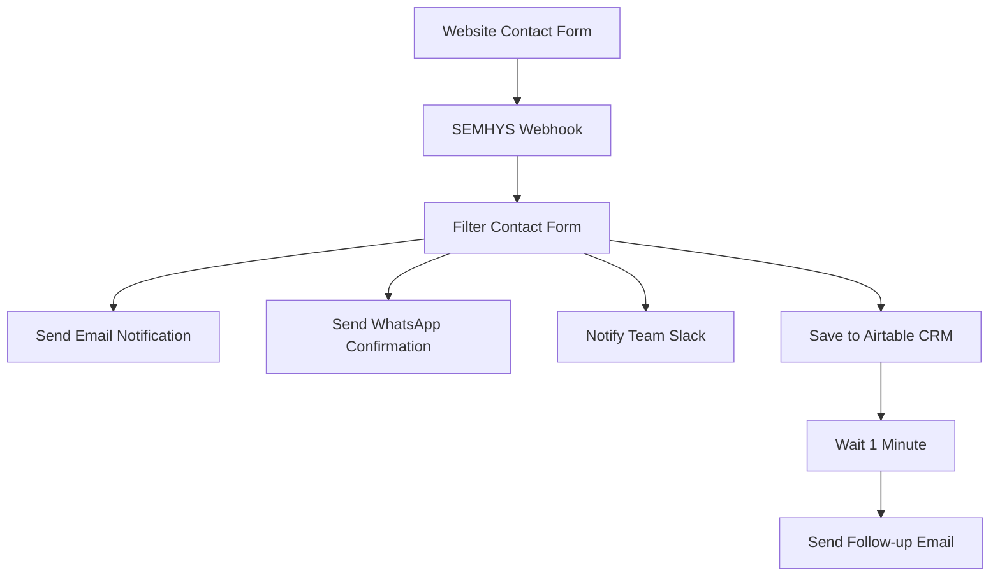

# Configuración n8n para SEMHYS

## 📋 Guía de Configuración Paso a Paso

### 1. Configuración Inicial de n8n

#### Instalación de n8n
```bash
# Opción 1: Usando Docker (Recomendado)
docker run -it --rm --name n8n -p 5678:5678 -v ~/.n8n:/home/node/.n8n n8nio/n8n

# Opción 2: Usando npm
npm install -g n8n
n8n start
```

#### Acceso a n8n
- URL: `http://localhost:5678`
- Crear cuenta de administrador
- Configurar credenciales iniciales

### 2. Importar Workflow de SEMHYS

1. **Ir a Workflows → Import from File**
2. **Cargar**: `n8n-workflows/semhys-contact-automation.json`
3. **Activar el workflow**

### 3. Configurar Webhook URL

#### En SEMHYS (Next.js)
```javascript
// .env.local
N8N_WEBHOOK_URL=http://tu-servidor-n8n.com:5678/webhook/semhys-contact
```

#### En n8n
1. **Abrir nodo "SEMHYS Contact Webhook"**
2. **Copiar la URL del webhook**
3. **Configurar como POST endpoint**

### 4. Configurar Integraciones

#### 📧 Gmail (Notificaciones Email)
1. **Credentials → Add Credential → Gmail OAuth2**
2. **Configurar OAuth2 con Google**
3. **Asignar al nodo "Send Email Notification"**

#### 📱 WhatsApp Business (Confirmaciones)
1. **Registrar WhatsApp Business API**
2. **Obtener Phone Number ID**
3. **Configurar en nodo "Send WhatsApp Confirmation"**

#### 💬 Slack (Notificaciones Team)
1. **Crear Slack Webhook URL**
2. **Ir a: https://api.slack.com/incoming-webhooks**
3. **Configurar en nodo "Notify Team (Slack)"**

#### 🗃️ Airtable CRM (Base de Datos)
1. **Crear base de datos en Airtable**
2. **Obtener API Key y Base ID**
3. **Configurar estructura:**
   ```
   - Name (Single line text)
   - Email (Email)
   - Company (Single line text)
   - Phone (Phone number)
   - Message (Long text)
   - Services (Multiple select)
   - Language (Single select: EN/ES/PT)
   - Source (Single line text)
   - Status (Single select: New Lead/Contacted/Qualified/Closed)
   - Created (Date)
   ```

### 5. Configurar Variables de Entorno

#### SEMHYS (.env.local)
```bash
# n8n Configuration
N8N_WEBHOOK_URL=http://tu-servidor-n8n.com:5678/webhook/semhys-contact
N8N_API_KEY=tu-n8n-api-key

# Email Configuration
EMAIL_FROM=noreply@semhys.com
GMAIL_CLIENT_ID=tu-gmail-client-id
GMAIL_CLIENT_SECRET=tu-gmail-client-secret

# WhatsApp Business
WHATSAPP_PHONE_ID=tu-whatsapp-phone-id
WHATSAPP_ACCESS_TOKEN=tu-whatsapp-access-token

# Airtable CRM
AIRTABLE_API_KEY=tu-airtable-api-key
AIRTABLE_BASE_ID=tu-airtable-base-id

# Slack Notifications
SLACK_WEBHOOK_URL=https://hooks.slack.com/services/tu/slack/webhook
```

### 6. Estructura del Workflow



### 7. Flujo de Automatización

#### Cuando se recibe un formulario de contacto:

1. **🔔 Webhook recibe datos**
   - Valida tipo de webhook (`contact_form`)
   - Extrae datos del formulario

2. **📧 Notificación inmediata al equipo**
   - Email a `team@semhys.com`
   - Incluye todos los detalles del contacto
   - CC a ingenieros relevantes

3. **📱 Confirmación automática al cliente**
   - WhatsApp al teléfono proporcionado
   - Mensaje personalizado por idioma
   - Confirmación de recepción

4. **💬 Notificación a Slack**
   - Canal #leads o #sales
   - Resumen ejecutivo del contacto
   - Enlaces rápidos para seguimiento

5. **🗃️ Guardado en CRM**
   - Registro automático en Airtable
   - Status: "New Lead"
   - Metadatos completos

6. **⏰ Follow-up automatizado**
   - Espera 1 minuto
   - Email de seguimiento al cliente
   - Próximos pasos y expectativas

### 8. Personalización por Idioma

#### Mensajes de WhatsApp
```javascript
// Español
"¡Hola {{name}}! 👋 Gracias por contactar SEMHYS..."

// English
"Hello {{name}}! 👋 Thank you for contacting SEMHYS..."

// Português
"Olá {{name}}! 👋 Obrigado por entrar em contato com a SEMHYS..."
```

#### Emails de Follow-up
- **Templates personalizados por idioma**
- **Firma de empresa profesional**
- **CTAs específicos por región**

### 9. Monitoreo y Analytics

#### Métricas a Trackear
- **Formularios recibidos por día/semana**
- **Tasa de respuesta de WhatsApp**
- **Conversión de leads a clientes**
- **Tiempo de respuesta del equipo**
- **Servicios más solicitados**

#### Dashboard en n8n
1. **Ver ejecuciones del workflow**
2. **Logs de errores**
3. **Performance de cada nodo**
4. **Rate limits y API usage**

### 10. Troubleshooting

#### Errores Comunes
```bash
# Webhook no recibe datos
- Verificar URL del webhook
- Comprobar método POST
- Revisar headers Content-Type

# Gmail no envía emails
- Verificar OAuth2 credentials
- Comprobar quotas de API
- Revisar spam folder

# WhatsApp falla
- Verificar Phone Number ID
- Comprobar Access Token
- Revisar formato de número
```

#### Logs Útiles
```javascript
// En SEMHYS API
console.log('📧 Sending to n8n:', webhookPayload);

// En n8n
console.log('🔔 Webhook received:', $json);
```

### 11. Producción y Scaling

#### Hosting n8n
- **DigitalOcean Droplet** (Recomendado)
- **AWS EC2** con PostgreSQL
- **Docker Compose** con Redis

#### Backup y Seguridad
- **Backup automático de workflows**
- **Credenciales en variables de entorno**
- **SSL/TLS para webhooks**
- **Rate limiting en APIs**

#### Performance
- **Connection pooling para DB**
- **Queue para procesos largos**
- **Retry logic para APIs externas**
- **Monitoring con Uptime Robot**

### 12. Próximos Pasos

1. **✅ Importar workflow base**
2. **🔧 Configurar todas las integraciones**
3. **🧪 Probar con datos de ejemplo**
4. **📈 Implementar analytics**
5. **🚀 Deploy a producción**
6. **📊 Monitorear y optimizar**

---

## 🚀 ¡Listo para Automatizar SEMHYS!

Con esta configuración tendrás un sistema completo de automatización que:
- **Captura leads 24/7**
- **Responde instantáneamente**
- **Notifica al equipo en tiempo real**
- **Organiza todo en tu CRM**
- **Hace seguimiento automático**

**¿Necesitas ayuda?** Contacta al equipo técnico de SEMHYS 💪